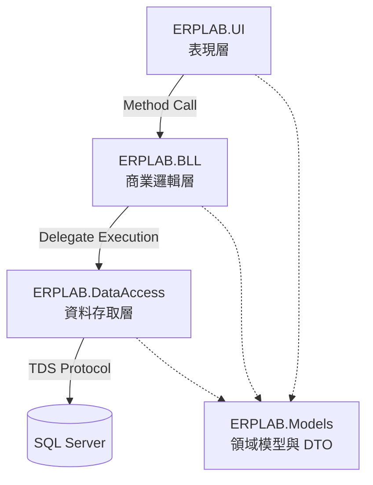

# ERPLAB 企業進銷存管理系統

   

本專案為針對企業內部進銷存作業開發之桌面端 ERP 系統。系統採用三層式架構 (3-Tier Architecture) 進行模組化開發，並以 ADO.NET 作為底層資料存取技術，旨在提供穩定的資料庫 I/O 效能、多使用者併發控制，以及嚴謹的資料完整性檢核。

---

## 🚀 快速啟動指南 (Quick Start)

### 1. 環境準備
*   IDE: Visual Studio 2022 (支援 .NET 8.0)
*   Database: Microsoft SQL Server 2022 (Developer / Express 均可)

### 2. 資料庫建置
請透過 SSMS 依序執行 `Database/` 目錄下的 SQL 腳本：
1.  `01_Schema.sql`：建立資料表與 UDTT (使用者自訂資料表型別)。
2.  `02_Constraints.sql`：建立外部鍵 (FK)、CHECK 約束與過濾唯一索引。
3.  `03_Programmability.sql`：建立觸發程序 (Triggers) 與檢視表。
4.  `04_SeedData.sql`：寫入地理字典、RBAC 權限矩陣與系統預設帳號。

### 3. 系統登入憑證
編譯並啟動 `ERPLAB.UI` 專案後，請使用以下預設帳號登入進行測試：
*   管理員權限：帳號 `ADMIN` / 密碼 `Admin@123`
*   一般使用者：帳號 `USER1` / 密碼 `User@123`

---

## 🏛️ 系統架構 (System Architecture)

本系統嚴格落實專案參考隔離，確保各層職責單一化：



*   **ERPLAB.UI**：負責視窗生命週期、狀態機控制與資料雙向綁定。不具備資料庫存取套件參考。
*   **ERPLAB.BLL**：負責跨模組商業規則運算、單號配發機制與狀態流轉檢核。
*   **ERPLAB.DataAccess**：負責 SQL 參數化封裝、批次寫入與非同步資料庫 I/O。

---

## 🗄️ 資料庫實體模型 (ER Models)

系統資料庫依據業務領域劃分為三大核心模型。詳細圖解請參閱 `docs/diagrams/` 目錄：

1.  **[RBAC 權限與資安模型](./docs/diagrams/er_01_security_rbac.png)**：
    採多對多關聯設計。將 `Accounts` 與 `Employee` 實體分離，並透過 `SystemNodes` 與 `Permissions` 表建立動態選單路由機制。
	<details>
	<summary><b>點擊展開 ER 圖</b></summary>

	```mermaid
	erDiagram
    %% =========================================================
    %% 關聯定義 (嚴守 IE Notation)
    %% =========================================================
    Employee ||..o| Accounts : "(ON DELETE NO ACTION)"
    Accounts ||--o{ UserRoles : "(ON DELETE NO ACTION)"
    Roles ||--o{ UserRoles : "(ON DELETE NO ACTION)"
    Roles ||--o{ RolePermissions : "(ON DELETE NO ACTION)"
    Permissions ||--o{ RolePermissions : "(ON DELETE CASCADE)"
    Permissions |o..o{ SystemNodes : "(ON DELETE NO ACTION)     (ON UPDATE CASCADE)"
    SystemNodes |o..o{ SystemNodes : "(ON DELETE NO ACTION)"
    %% =========================================================
    %% 實體定義
    %% =========================================================
    Accounts {
        AccountID int PK
        EmployeeID int FK 
        Username varchar(50) UK "過濾唯一索引 (UK)"
        PasswordHash varchar(255) "Identity V3 封裝"
        IsLocked bit "防暴力破解鎖定"
        FailedCount tinyint
        IsActive bit "軟刪除防線"
        RowVersion timestamp "樂觀鎖"
        other 其它欄位
    }
    Roles {
        RoleID int PK
        RoleCode varchar(50) UK
        IsSystem bit "系統內建防護"
        IsActive bit "暫時隔離用"
        other 其它欄位
    }
    Permissions {
        PermissionCode varchar(100) PK "自然主鍵"
        PermissionName nvarchar(50) 
        IsActive bit "暫時隔離用"
    }
    UserRoles {
        AccountID int PK, FK "複合主鍵"
        RoleID int PK, FK "複合主鍵"
        other 其它欄位
    }
    RolePermissions {
        RoleID int PK, FK "複合主鍵"
        PermissionCode varchar(100) PK, FK "複合主鍵"
        other 其它欄位
    }
    SystemNodes {
        NodeID int PK
        NodeType tinyint
        ParentNodeID int FK "自我參照 (樹狀結構)" 
        FormClassPath varchar(255) "UI 反射路由字串"
        PermissionCode varchar(100) FK "允許 NULL (目錄節點)"
        IsActive bit "暫時隔離用"
        other 其它欄位
    }
    Employee {
        EmployeeID int PK
        EmployeeNo varchar(20) UK
        JobStatus tinyint "人事狀態"
        IsActive bit "軟刪除防線" 
        RowVersion timestamp "樂觀鎖"       
        other 其它欄位
    }
    ```

	</details>
2.  **[進銷存主明細交易模型](./docs/diagrams/er_02_trading_inventory.png)**：
    實作 Master-Detail 架構。單據過帳後受 `INSTEAD OF DELETE` 觸發程序保護；庫存異動採用差異沖平演算法確保帳實一致。
	<details>
	<summary><b>點擊展開 ER 圖</b></summary>

	```mermaid
	erDiagram
    %% =========================================================
    %% 關聯定義 (全數為非識別性弱關聯)
    %% =========================================================
    Customer ||..o{ SalesMaster : "(ON DELETE NO ACTION)"
    Base_District ||..o{ SalesMaster : "(ON DELETE NO ACTION)"
    SalesMaster ||..|{ SalesDetail : "(ON DELETE NO ACTION)"
    Product ||..o{ SalesDetail : "(ON DELETE NO ACTION)"
    %% =========================================================
    %% 實體定義 (AutoNumber 無實體 FK，故獨立展示)
    %% =========================================================
    Customer {
        CustomerID int PK
        CustomerNo varchar(20) UK "單據號碼 (來自 AutoNumber)"
        CustomerName nvarchar(50)
        IsActive bit "軟刪除防線"
        RowVersion timestamp "樂觀鎖"
        other 其它欄位
    }
    SalesMaster {
        SalesID bigint PK
        SalesNo varchar(20) UK "單據號碼 (來自 AutoNumber)"
        CustomerID int FK
        ShipDistrictID int FK
        ShipZipCode varchar(6) "歷史郵遞區號(快照)"
        ShipAddress nvarchar(200) "歷史出貨地址(快照)"
        TotalAmount decimal(18,2) "總計 (反正規化快取)"
        Status tinyint "4維狀態機: 1=草稿, 2=過帳..."
        RowVersion timestamp "樂觀鎖"
        other 其它欄位
    }
    SalesDetail {
        SalesDID bigint PK "非叢集主鍵"
        SalesID bigint FK "複合叢集索引 (與 LineNo 綁定)"
        LineNo int "明細行號"
        ProductID int FK "關聯商品"
        UnitPrice decimal(18,2) "歷史單價 (快照)"
        UnitCost decimal(18,2) "歷史成本快照"
        Qty int 
        other 其它欄位
    }
    Product {
        ProductID int PK
        ProductNo varchar(20) UK "單據號碼 (來自 AutoNumber)"
        ProductName nvarchar(100) 
        CurrentStock int "實體庫存 (受 CHECK 約束)"
        IsActive bit "軟刪除防線"
        RowVersion timestamp "樂觀鎖"
        MovingAverageCost decimal "移動加權平均成本"
        other 其它欄位
    }
    AutoNumber {
		    DocType varchar PK "單據類型 (獨立微交易取號)"
        CurrentDate  DATE "當前日期 (滾動重置)"
        LastSeq int "最後流水號"
    }
	```

	</details>
3.  **[基礎主檔與地理連動模型](./docs/diagrams/er_03_master_geography.png)**：
    實作 `IsActive` 軟刪除機制，並與 `Base_City`、`Base_District` 建立實體外鍵約束，維持歷史單據的參照完整性。
	<details>
	<summary><b>點擊展開 ER 圖</b></summary>

	```mermaid
	erDiagram
    %% =========================================================
    %% 關聯定義 (全數為非識別性弱關聯)
    %% =========================================================
    Base_City ||..o{ Base_District : "ON DELETE NO ACTION"
    Base_District ||..o{ Customer : "ON DELETE NO ACTION"
    Base_District ||..o{ Vendor : "ON DELETE NO ACTION"
    Base_District ||..o{ Employee : "ON DELETE NO ACTION"
    %% =========================================================
    %% 實體定義
    %% =========================================================
    Base_City {
        CityID int PK
        CityNo varchar(10) UK "政府官方代碼"
        CityName nvarchar(20) 
        SortSeq int "UI 渲染權重"
        IsActive bit "軟刪除防線"
    }
    Base_District {
        DistrictID int PK
        CityID int FK
        ZipCode varchar(3) "精確 3 碼"
        DistrictName nvarchar(20) 
        SortSeq int "UI 渲染權重"
        IsActive bit "軟刪除防線"
    }
    Customer {
        CustomerID int PK
        CustomerNo varchar(20) UK
        DistrictID int FK "地理強外鍵"
        CustomZipCode varchar(6) "3+3 碼後綴"
        Address nvarchar(200) "街道門牌"
        other 其它欄位 
    }
    Vendor {
        VendorID int PK
        VendorNo varchar(20) UK
        DistrictID int FK "地理強外鍵"
        CustomZipCode varchar(6) "3+3 碼後綴"
        Address nvarchar(200) "街道門牌"
        other 其它欄位 
    }
    Employee {
        EmployeeID int PK
        EmployeeNo varchar(20) UK
        DistrictID int FK "地理強外鍵"
        CustomZipCode varchar(6) "3+3 碼後綴"
        Address nvarchar(200) "街道門牌"
        other 其它欄位
    }
	```

	</details>

---

## ⚙️ 核心工程實作 (Technical Implementations)

### 1. 批次寫入與交易控制 (Batch Processing & ACID)
*   **實作細節**：於銷貨/進貨單據寫入時，採用 **表值參數 (Table-Valued Parameter, TVP)** 將明細清單轉換為 `DataTable`。
*   **工程效益**：將數百筆明細的 `INSERT` 作業整併為單次網路往返 (Round-trip)，降低連線池佔用時間；並透過 `SqlTransaction` 確保主檔與明細寫入的資料一致性。

### 2. 樂觀鎖併發控制 (Optimistic Concurrency)
*   **實作細節**：於業務主檔配置 `[RowVersion] TIMESTAMP` 欄位。資料存取層執行 `UPDATE` 時，透過比對時間戳記並判斷 `ExecuteScalarAsync` 回傳值。
*   **工程效益**：在不提升資料庫交易隔離層級的前提下，有效防範多使用者並行操作時產生的「遺失更新 (Lost Update)」問題，發生衝突時交由 UI 層提示並重新載入。

### 3. 記憶體管理與密碼學實作 (Memory-Optimized Cryptography)
*   **實作細節**：密碼驗證模組採用 PBKDF2 演算法，並相容 Identity V3 的二進位封裝格式。處理過程中採用 `stackalloc` 與 `Span<byte>` 進行記憶體操作，並使用 `CryptographicOperations.FixedTimeEquals` 比對陣列。
*   **工程效益**：避免頻繁生成短生命週期的 `byte[]` 陣列，降低 Garbage Collection (GC) 觸發頻率；常數時間比對機制亦提升了防禦時序攻擊的能力。

### 4. 資料綁定與 UI 狀態機 (Data Binding & State Machine)
*   **實作細節**：自訂 `ExtendedBindingList<T>` 實作 `AddRange` 方法以暫停事件觸發。UI 層以 `BindingSource` 統一管理游標位置，並依據表單狀態 (Browse/Add/Edit) 動態控制控制項的 `ReadOnly` 與 `Enabled` 屬性。
*   **工程效益**：減少 DataGridView 在大量資料載入時的重繪次數 (消除畫面閃爍)；支援無滑鼠的鍵盤連續輸入作業，提升終端使用者的資料建檔效率。

---

## 📸 介面展示 (Screenshots)

*   **銷售戰情儀表板**：展示基於 SQL 聚合函數的營運數據與排行。[檢視截圖](./docs/screenshots/ui_sales_dashboard.png)
*   **單據主明細作業畫面**：展示資料雙向綁定與鍵盤輸入之試算連動。[檢視操作動圖](./docs/screenshots/ui_sales_order_blind_typing.webp)
*   **基礎資料維護畫面**：展示地理資訊二級連動與狀態機鎖定機制。[檢視截圖](./docs/screenshots/ui_customer_crud.png)